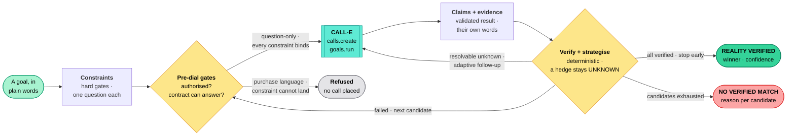

<div align="center">

<picture>
  <source media="(prefers-color-scheme: dark)" srcset="docs/brand/wordmark-dark.png">
  
</picture>

**When the internet isn't enough, ask the people who know.**

*An agentic verification engine: it calls the real world to settle facts no database holds, and returns evidence-backed claims instead of guesses.*

**CALL-E — Your Code Is Calling** hackathon

[Demo video](https://youtu.be/kjqOmoUesiE) · [Live demo](https://groundtruth-calle.vercel.app) · [For judges](#for-judges--3-minutes-no-credentials) · [Architecture](#architecture) · [Where CALL-E runs](#where-call-e-actually-runs) · [The Agent Skill](#the-contribution--a-reusable-agent-skill)


</div>

---

## For judges — 3 minutes, no credentials

**[Watch the 2:38 demo](https://youtu.be/kjqOmoUesiE)**, open
**[groundtruth-calle.vercel.app](https://groundtruth-calle.vercel.app)**, or run
it yourself — which needs no credentials at all:

```bash
pnpm install
cp .env.example .env.local     # defaults are fine; demo mode needs no keys
pnpm dev                       # http://localhost:3000
```

Click **Verify Reality** → **Analyze goal** → **Start verification**. Everything
below happens on its own, identically on every run.

| # | What to watch | Why it matters |
| --- | --- | --- |
| 1 | **Understanding your request** — each hard requirement shown with *the exact phone question it becomes* | The goal is compiled into checkable gates, not vibes |
| 2 | Calls stream in: dialing → live transcript → structured result → per-constraint verdicts | CALL-E runs the conversation; GroundTruth reads it |
| 3 | **Anand Cool Point** says *"I think we have it"* → stays **UNKNOWN** | A hedge never becomes a verified fact |
| 4 | **Metro Components**: hold *pending manager approval* → an **automatic follow-up call** → hold confirmed | The second question exists because state demanded it, not because a script said so |
| 5 | Two suppliers are **never called** | Early stop once every hard requirement is verified |
| 6 | Click the **Hold confirmed until 5 PM** chip | The evidence modal: CALL-E call ID, confidence, and the supplier's own words — the full arc from *"I need to ask my manager"* to *"approved, held until 5 PM"* |
| 7 | Re-run with the **honest failure** scenario | `NO FULLY VERIFIED MATCH`, with the reason each candidate failed. No fake success |

Verify the engineering in one command each:

```bash
pnpm test        # 79 unit + integration tests
pnpm test:e2e    # 2 Playwright flows against a production build
pnpm typecheck && pnpm lint && pnpm build
```

### How this maps to the judging criteria

| Criterion | The short answer | Where to look |
| --- | --- | --- |
| **Real world impact** | Emergency parts procurement runs on phone calls today, one at a time, done by the most expensive person available, with no record of what was promised. GroundTruth compresses an afternoon of calling into one auditable run. | [The problem](#the-problem) |
| **Quality of the idea** | CALL-E is used as a **sensor for a constraint solver**, not as a talking bot. `UNKNOWN` is a protected state; an honest "no" is a first-class output. | [What GroundTruth does](#what-groundtruth-does) |
| **Technical implementation** | Real SDK, called at runtime, on **two** execution paths — ad-hoc `calls.create` and published `goals.run` — plus idempotency keys, a deduplicated webhook receiver, and a pre-dial contract check. Verified with [a real call](#proof-a-real-call-and-an-honest-no). | [Where CALL-E actually runs](#where-call-e-actually-runs) |
| **Product experience & demo** | A complete loop from plain-language goal to evidence you can click into, including the failure path. | [Demo](#demo) |

---

## The problem

AI can search websites and databases, but many operational facts exist only
with a human answering a phone:

- *Is this part actually in stock?* — the website says "call for availability".
- *Is the exact revision compatible?* — only the counter person knows the
  XZ-420B does not fit the HVAC-200.
- *Can the supplier hold it until 5 PM?* — needs a manager's OK, live.

A failed 40-minute drive to a supplier that "showed" stock on a stale listing
is a real cost: a technician idle, a repair postponed, a customer waiting.
Emergency procurement under time pressure runs on phone calls today, done by
the most expensive person available, one call at a time, with no record of
what was promised.

**Why a phone call is the only instrument.** The ground truth is not written
down. Stock quantities change hourly, compatibility knowledge lives in
people's heads, and holds are personal favours between businesses. No API,
scraping run, or model trained on last year's web can tell you whether *this*
store has *this* part *right now* and will keep it at the front desk until
5 PM. A phone call can.

## What GroundTruth does

It turns a fuzzy request into **hard constraints**, calls candidates through
**CALL-E**, adapts its questions to what each supplier actually says, and
returns **claims with evidence** — each verified claim linked to the CALL-E
call, the supplier's own words, and a confidence score.

It is **not** an AI phone caller with a memory. It is a constraint-solving
verification system whose phone work is delegated to CALL-E.

Three rules do most of the work:

1. **A hedge is not a fact.** "Probably", "I think", "we usually have it" are
   `uncertain`, and an uncertain answer leaves the constraint unresolved. One
   polite follow-up is allowed; after that, the system moves on and says so.
2. **No evidence, no verified claim.** Verification requires the validated
   structured result *and* stored provenance. Verified claims are immutable;
   contradictions are recorded, never erased.
3. **An honest "no" is a result.** When no candidate satisfies every hard
   requirement, the output is `NO FULLY VERIFIED MATCH` with a per-candidate
   breakdown — never a softened yes.

## Architecture



Two gates sit in front of every call, and both can refuse without dialing:
the **safety gate** (is this action authorised? does the composed text contain
side-effect language?) and, on the Goal path only, the **contract check**
(can this published Goal's result schema actually answer every hard
constraint?).

```
app/                    Next.js UI + route handlers (tasks, tick loop, webhook)
lib/agent/              planner (goal -> call plan), strategist (adaptive
                        follow-up/next/stop), resolver (orchestrator + tick)
lib/ai/                 goal analyzer: deterministic heuristic (default) or
                        optional OpenAI-compatible LLM (fail-closed)
lib/calle/              CALL-E adapter seam: three execution paths behind one
                        interface — ad-hoc calls.create, published goals.run,
                        deterministic mock (DEMO MODE) — plus the Goal
                        compatibility checker, result schemas, client factory
lib/verification/       constraints (deterministic evaluation), claims
                        (lifecycle), evidence, confidence, decision
lib/safety/             authorization gates, side-effect phrase scanner,
                        PII redaction
lib/discovery/          CandidateProvider interface + demo/manual/web providers
lib/demo/               deterministic supplier personas + scenarios
lib/db/                 Drizzle PostgreSQL schema + in-memory store behind one
                        interface (DATABASE_URL switches backend)
skills/                 the reusable Agent Skill contribution
```

Full details: [docs/architecture.md](docs/architecture.md).

## Where CALL-E actually runs

CALL-E is a genuine runtime dependency — the system places no call without
it. Integration uses the official TypeScript SDK `@call-e/calle@0.7.0`.

| Concern | File | SDK surface |
| --- | --- | --- |
| Ad-hoc call tasks | [lib/calle/adapter.ts](lib/calle/adapter.ts) | `client.calls.create` (with `Idempotency-Key`), `client.calls.get` |
| Published Goal runs | [lib/calle/goal-adapter.ts](lib/calle/goal-adapter.ts) | `client.goals.get`, `client.goals.run`, `client.goals.getRun` |
| Pre-dial contract check | [lib/calle/goal-binding.ts](lib/calle/goal-binding.ts) | reads `publishedRunSpec.inputSchema` / `resultSchema` |
| Terminal webhook | [app/api/webhook/calle/route.ts](app/api/webhook/calle/route.ts) | `call.completed` / `call.failed` / `call.result_validation_failed` |
| Client + mode resolution | [lib/calle/client.ts](lib/calle/client.ts) | `new CalleClient({ apiKey, baseUrl })` |
| Result contract | [lib/calle/schemas.ts](lib/calle/schemas.ts) | the strict `resultSchema` sent with every call |

What CALL-E is doing that GroundTruth does not attempt itself: running the
live conversation, handling pickup/voicemail/hold/transfers/IVR, extracting a
schema-validated result, and reporting `completionConfidence`. GroundTruth
composes the questions and does the constraint solving.

**Idempotency, both paths.** Every logical call carries a deterministic key
(`taskId + candidateId + purpose + attempt`), so a duplicated orchestration
tick can never double-dial a human.

**Two ingestion routes, one code path.** Poll results and webhook deliveries
both land in `onCallTerminal`, so they produce identical claims and evidence.
Webhook events are deduplicated by event id before processing.

### Proof: a real call, and an honest "no"

One real verification call was placed through CALL-E to a consenting test
number. The full run is in the audit log; the parts that matter:

```
[CALL-E] MODE           {"mode":"real","execution":"call","baseUrl":"https://api.heycall-e.com"}
[CALL-E] CALL CREATED   {"calleCallId":"call_DxfIoUheBQMhn2GeKu0_Ww","status":"queued",...}
[CALL-E] CALL COMPLETED {"calleCallId":"call_DxfIoUheBQMhn2GeKu0_Ww","taskCompleted":true,
                         "completionConfidence":0.78}
```

37 transcript turns. The supplier was evasive in the way real people are —
half-answers, a talk-over, one "regarding what are you discussing about?":

```
[107s] GT : Thanks — is a genuine XZ-420 compressor physically in stock right now, or not?
[115s] SUP: Correct. No, not at the moment.
[118s] GT : Could you tell me whether pickup is available today, and if so, what time?
[126s] SUP: No.
```

Note what the agent did at 107s: the first stock answer was hedged, so it
re-asked with the planned fallback question — *"physically in stock right
now, or not?"* — and got a definite answer.

CALL-E returned this, and GroundTruth accepted every part of it:

| Constraint | Result | Claim |
| --- | --- | --- |
| In stock | `not_available` | **failed** |
| Pickup today | `false` | **failed** |
| Price | never answered | **unknown** — not guessed |
| Compatibility | `uncertain` | **unknown** — not promoted |
| Hold until 5 PM | never answered | **unknown** |

**Decision: `no_match`, confidence 0.** Five questions asked, two answered,
three left open — and not one of them was invented to manufacture a result.
That is the whole thesis, on a real phone call with a real human.

Reproduce it safely against your own number:

```bash
MOCK_CALL_E=false CALLE_API_KEY=... pnpm start
node scripts/real-call.mjs http://localhost:3000 +91XXXXXXXXXX "Test Supplier"
```

`createTask` seeds a task with the demo scenario's suppliers, whose numbers
are fictional but well-formed — in real mode those would dial actual
strangers. The script retires every discovered candidate and **refuses to
start** unless the pending set is exactly the one number you nominated.
`DRY_RUN=true` exercises that gate without spending a call.

### The part worth reviewing: a published Goal can be *unable* to answer you

A published CALL-E Goal owns its own version-pinned `resultSchema`. It can be
perfectly healthy and still be **structurally incapable** of settling one of
your hard constraints, because no declared field can carry the answer.
Running it anyway spends a real phone call on a real person and returns a
constraint that can only ever be `UNKNOWN`.

So GroundTruth type-checks the Goal against the constraint set *before* the
run is created:

| Check | Failure |
| --- | --- |
| Every phone-derived constraint binds to a declared result field | `unanswerable` |
| Every required input variable can be supplied | `missingVariables` |

An incompatible pairing raises `GoalIncompatibleError`, the task fails with a
`GOAL_INCOMPATIBLE` audit entry, and **no call is placed**. This is the
project's core rule — never claim a verification the evidence cannot support —
moved one step earlier, to before the call exists.

Field binding is family-based, so a Goal may name things its own way
(`availability` ← `availability | in_stock | stock_status`, and so on). Full
detail: [docs/call-e-integration.md](docs/call-e-integration.md).

**Honest limitation:** a Goal run exposes no transcript. Claims from that path
carry structured-result evidence and the correlated call id, but no verbatim
quote — and the code says so rather than implying one exists.

## The contribution — a reusable Agent Skill

[`skills/groundtruth-verification/`](skills/groundtruth-verification/) packages
the protocol for anyone building phone-work agents, for contribution to
[awesome-phone-call-agents](https://github.com/CALLE-AI/awesome-phone-call-agents):
fictional phone numbers only, mock by default, side effects and cancellation
documented, no secrets.

- `SKILL.md` — when to use it, how to formulate a verification goal, the
  non-negotiable rules, stopping rules, failure handling.
- `references/` — the verification protocol, the evidence model, the safety
  boundaries.
- `scripts/build-call-task.mjs` — compose a protocol-compliant CALL-E call
  task + result schema from a goal JSON. Zero dependencies.
- `scripts/check-goal-compatibility.mjs` — decide whether a published Goal can
  answer a verification goal *before* you spend a call on it. Works offline
  against a saved Goal document, or live via `goals.get` (read-only).

```bash
node skills/groundtruth-verification/scripts/check-goal-compatibility.mjs \
  goal.json --spec published-goal.json
# exit 0 = compatible · exit 2 = do not run this Goal
```

## Demo

**▶ [Watch the demo (2:38)](https://youtu.be/kjqOmoUesiE)**

The deterministic demo works offline in DEMO MODE:

1. **Landing** (`/`) — the pitch and the core loop.
2. **Verify Reality** (`/verify`) — flagship request pre-filled; *Analyze*
   shows the understanding step: goal, hard requirements with their phone
   questions, preferences, authorized vs. prohibited actions.
3. **Start verification** → the live dashboard, as walked through in
   [For judges](#for-judges--3-minutes-no-credentials).
4. **Decision banner** — REALITY VERIFIED: XZ-420 compressor, Metro
   Components, ₹22,800, hold until 5 PM, with *Why this result?*
5. **Failure path** — re-run with the *honest failure* scenario for
   `NO FULLY VERIFIED MATCH` and the full breakdown.

Shot list and narration notes: [docs/demo.md](docs/demo.md).

## Features

- **Goal understanding** with a visible understanding step: goal, hard
  requirements (with the exact phone question each maps to), preferences, and
  authorized vs. prohibited actions.
- **Multi-call orchestration** with candidate prioritization (distance,
  provider order), per-candidate call budgets, and early stopping.
- **Adaptive questioning** — a second call is generated because the first
  answer left a constraint UNKNOWN ("hold possible but needs manager
  approval" → automatic follow-up → hold confirmed until 5 PM).
- **Claims + evidence as first-class objects** — `unknown`, `verified`,
  `contradicted`, `failed`, `expired` lifecycle; evidence = structured result
  + transcript excerpt + call ID + confidence. Hedges never verify.
- **Deterministic constraint evaluation** — price ≤ ceiling, distance ≤
  radius, compatibility confirmed, hold confirmed. No LLM in the loop.
- **Goal compatibility gate** — an incompatible published Goal is refused
  before a human is dialed, not discovered afterwards as a permanent UNKNOWN.
- **Honest failure** — `NO FULLY VERIFIED MATCH` with per-candidate reasons.
- **Safety by construction** — orchestration-layer authorization, negation-
  aware side-effect phrase gate, PII redaction, masked numbers, audit log,
  and demo supplier personas that refuse to be dialled outside mock mode.
- **DEMO MODE** — a deterministic mock CALL-E with scripted supplier personas
  (success and failure narratives), clearly labeled, never pretending to be
  real.

## Safety model

Question-only verification, enforced structurally rather than by prompt:

- Authorization is validated at goal creation and re-checked per action at
  plan time; a prohibited action throws before any call exists.
- A negation-aware prohibited-phrase gate runs on the **exact text** handed to
  CALL-E, so the safety footer itself never trips the scanner.
- Prohibited parts of a request are **refused out loud** — a
  `REQUEST_PARTIALLY_REFUSED` audit entry, a warning event and a blocked-action
  ledger row — rather than silently dropped, so the operator is never left
  believing the purchase leg is still coming.
- PII is redacted before persistence and display; phone numbers are masked;
  operator text is redacted with a narrower rule that preserves prices and
  deadlines.
- Every significant step is written to an audit log.

GroundTruth never purchases, pays, accepts offers, or handles credentials.
Assumptions and residual risks: [docs/threat-model.md](docs/threat-model.md).

## Evidence model

A claim is verified only when the deterministic evaluation passes, the CALL-E
completion confidence is sufficient, and evidence is attached: the validated
structured result plus the supplier's own words from the transcript. Verified
claims are immutable; contradictions are recorded, never erased. Confidence is
CALL-E's completion confidence propagated through the weakest verified
constraint of the winner. Full model:
[evidence-model.md](skills/groundtruth-verification/references/evidence-model.md).

## Configuration

| Variable | Required | Purpose |
| --- | --- | --- |
| `MOCK_CALL_E` | no (default `true`) | `true` = deterministic mock CALL-E, UI labeled DEMO MODE |
| `CALLE_API_KEY` | only for real mode | CALL-E API key, `iams_live_…` / `iams_test_…` from [dashboard.heycall-e.com/account/api-keys](https://dashboard.heycall-e.com/account/api-keys) (server-only; never sent to the client) |
| `CALLE_BASE_URL` | no | Defaults to `https://api.heycall-e.com` |
| `CALLE_GOAL_ID` | no | Run verification through this published Goal (`goals.run`) instead of composing call tasks |
| `DATABASE_URL` | no | PostgreSQL (Neon/Supabase/local). Absent ⇒ in-memory store |
| `WEBHOOK_TOKEN` | real mode | Shared token in the registered webhook URL |
| `APP_ORIGIN` | real mode | Public origin used to build the webhook URL |
| `LLM_BASE_URL` / `LLM_API_KEY` / `LLM_MODEL` | no | Optional goal analyzer upgrade; fails closed to the heuristic |
| `REDACT_PII` | no (default `true`) | PII redaction before persistence/display |

### Mock mode

`MOCK_CALL_E=true` (the default) swaps the CALL-E adapter for a deterministic
simulator: six fictional suppliers with scripted conversations covering the
whole outcome space (sold out, incompatible revision, over budget, "I think
we have it", no answer, and the winner with an adaptive hold follow-up). Every
poll advances the call one stage, so the dashboard streams realistically
without depending on the wall clock, and the narrative is identical on every
run. Mock mode is always labeled **DEMO MODE**; it never contacts CALL-E and
never pretends to be real.

### Real CALL-E mode

```bash
# A. Ad-hoc call tasks — GroundTruth composes the questions.
MOCK_CALL_E=false CALLE_API_KEY=... pnpm start

# B. Published Goal — CALL-E owns the questions and the result schema.
MOCK_CALL_E=false CALLE_API_KEY=... CALLE_GOAL_ID=goal_... pnpm start
```

Add `WEBHOOK_TOKEN` and `APP_ORIGIN` for webhook-driven completion. Every
CALL-E interaction is logged: `[CALL-E] CALL CREATED`, `CALL COMPLETED`,
`RESULT RECEIVED`, `WEBHOOK RECEIVED`, and on the Goal path `GOAL LOADED`,
`GOAL COMPATIBILITY`, `GOAL RUN CREATED`, `GOAL RUN COMPLETED`. Real mode
without a key fails loudly at the adapter factory — it never silently falls
back to mock.

## Development

```bash
pnpm lint          # eslint (0 errors, 0 warnings)
pnpm typecheck     # next typegen && tsc --noEmit
pnpm test          # 79 unit + integration tests (vitest)
pnpm build         # production build
pnpm test:e2e      # 2 Playwright e2e flows against the production build
pnpm db:push       # apply the Drizzle schema when DATABASE_URL is set
```

Contribution workflow for the skill: [CONTRIBUTING.md](CONTRIBUTING.md).

## Known limitations

- In-memory store (no `DATABASE_URL`) resets on restart and is single-process,
  so any serverless deployment needs `DATABASE_URL` set — a task created on
  one instance is otherwise invisible to the next poll. Demo-mode call state
  is durable: the mock adapter treats its per-process stage map as a cache
  and rehydrates script and stage from the store on a miss, so a poll landing
  on a cold instance resumes the same narrative instead of failing the call.
- The tick loop assumes one server process; horizontal scaling needs the
  Postgres store plus a job runner for `tick`.
- `WebCandidateProvider` is an architecture stub — discovery is demo/manual
  by design so the demo never depends on unpredictable search results.
- The webhook token is a shared secret in the URL; current CALL-E deliveries
  are unsigned (the SDK deprecates its signature helpers), so this is the
  strongest available transport auth today.
- Mock mode scripts conversations; real-mode conversation quality is CALL-E's
  to deliver. The one real call recorded above went through a talk-over and a
  confused stretch before settling — that is what a real counter sounds like,
  and why hedges are treated as UNKNOWN rather than parsed optimistically.
- The Goal path exposes no transcript, so claims verified that way carry
  structured-result evidence and the correlated call id but no verbatim
  supplier quote. Use the ad-hoc call path when quotes matter.
- Goal field binding uses a fixed family map. A Goal that names a field
  outside its family reads as unanswerable and is refused — deliberately
  conservative, but an unusual Goal needs a map entry rather than silently
  degrading.
- No published verification Goal ships with this repo: Goals are published
  out-of-band through CALL-E, and the SDK exposes `list`/`get`/`run` only. The
  Goal path is covered by unit tests and the standalone compatibility script;
  running it end-to-end needs a Goal id from a CALL-E account.

## License

MIT — see [LICENSE](LICENSE).
